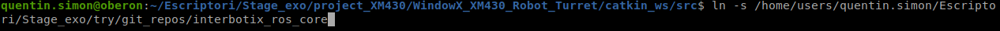

 # Package for WidowX XM430 Robot Turret

To be able to use this project it is very simple, you need the ROS environment to install on your computer. If you don't know how to click on this link, it's the UPC Barcelona tutorial: [Ros_tuto_upc](https://sir.upc.edu/projects/rostutorials/1-ROS_basic_concepts/index.html)


It is strongly advised to work with git, if you want to think about setting it up.
Once your computer is ready and it works I advise you to create a project folder. In the project directory (or the name you gave it), create two new folders, for my part I had to create a package folder and another WidowX XM430 Robot Turret.


Now open a terminal (Terminator) install following the previous tutorial. Why use Terminator? Terminator organizes terminals in a grid. It is useful because many terminals are usually needed simultaneously when working with ROS. 
Then using the command cd [path] go to the folder you created (package). Once you are inside do:
git clone [project git https links]

Once this is done if the project has been cloned in your reference directory, if it is good try to compile the project by simply doing:
```
$ catkin_make
```
If this command executes without problem, the project is compiled and you can therefore use it later because half of the files are missing for the project to work.

Let's move on to the second part so that the project is complete.
 
* Open a second terminal and create a folder git-repos, go to the folder
* Clone this repos in that folder :
    -[DynamixelSDK](https://github.com/ROBOTIS-GIT/DynamixelSDK.git)  
    -[interbotix_ros_core](https://github.com/Interbotix/interbotix_ros_core.git)  
    -[interbotix_ros_toolboxes](https://github.com/Interbotix/interbotix_ros_toolboxes.git)  
    -[interbotix_ros_turrets](https://github.com/Interbotix/interbotix_ros_turrets.git)  

*  Change to noetic branch in the interbotix repos :
```
$ cd interbotix_ros_core
$ git checkout noetic
$ cd interbotix_ros_toolboxes
$ git checkout noetic
$ cd interbotix_ros_turrets
$ git checkout noetic
```
* Drop the file CATKIN IGNORE
```
$ cd git-repos # or where you have clone the repos
$ cd interbotix_ros_core
$ rm interbotix_ros_xseries/CATKIN_IGNORE
$ cd ..
$ cd interbotix_ros_toolboxes
$ rm interbotix_xs_toolbox/CATKIN_IGNORE
```

So now, in an other terminator go to the second folder (WidowX_XM430_Robot_Turret) and di this : 
```
$mkdir -p catkin_ws/src
$cd catkin_ws/src
$ ln -s where_git_repos_are_located/DynamixelSDK/ros/dynamixel_sdk
$ ln -s where_git_repos_are_located/interbotix_ros_core
$ ln -s where_git_repos_are_located/interbotix_ros_toolboxes
$ ln -s where_git_repos_are_located/interbotix_ros_turrets
```
For example, when I tested my path was:



Once this is done we can compile this file. Just after finishing the previous commands do:
```
$cd ..
$catkin build
```

If the compilation is successful, then you are ready to use the project.

Here is a diagram of what you should have on your computer before the compilation in blue and once the compilation is done the red folders are added to it(this is an example, so these are the names I decided to put, yours may be different but the structure remains the same):


## Execution step

Before running the programs, check that you have the ttyDXL port which is the one requested to be able to run the simulation programs, if you do not have this port either you configure it or you change it in the programs of the WidowX_XM430 folder. For me, the easiest way is to use this port.

As soon as the port configuration is done, open the pan_tilt.cpp file in the package folder then source. This is where you choose whether to move the gazebo simulation robot or not. Choose the right class, the program is commented, read the comments to know which class corresponds to what. If you forget or set the wrong classes the program will run fine but nothing will happen.

Open a terminal, go to the WidowX_XM430 directory then catkin_ws, once here compile then make:

`$ source devel/setup.bash`

Once this is done if you want to use the simulation made:

`$roslaunch interbotix_xsturret_gazebo xsturret_gazebo.launch robot_model:=wxxms`

It is possible that for the gazebo part you have an error when launching it with roslaunch, if this is the case go to interbotix_ros_turrets then interbotix_ros_turrets then interbotix_xsturret_gazebo, go to the launch folder then comment out the line:

 `<arg name="rviz_frame" value="$(arg rviz_frame)"/>` 
 
Recompile then restart roslaunch and the simulation will start.
Or if you are not in simulation but you want to move the physical robot do:

`roslaunch interbotix_xsturret_control xsturret_control.launch robot_model:=wxxms`

After that open a second terminal, go to the package directory, compile the program to be sure you have no problem, then do:

`$ source devel/setup.bash`

Then run the program:

`rosrun pckg pan_tilt`

If all goes well you will see the robot doing what you asked it to do in the pan_tilt.cpp program. Now it's up to you, you can develop, modify or simply use this project.


